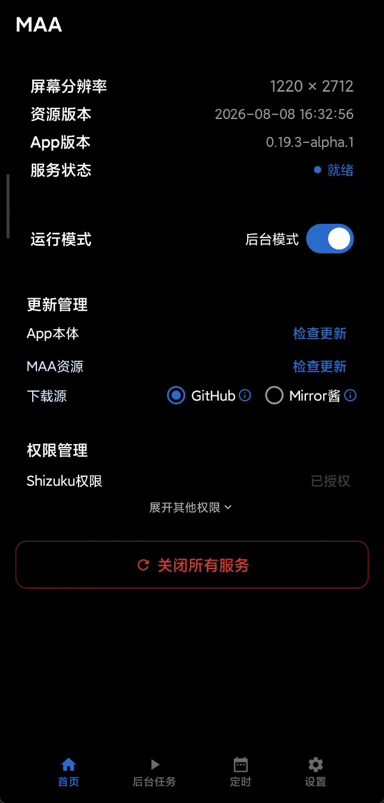
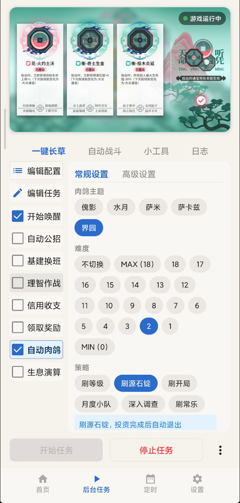
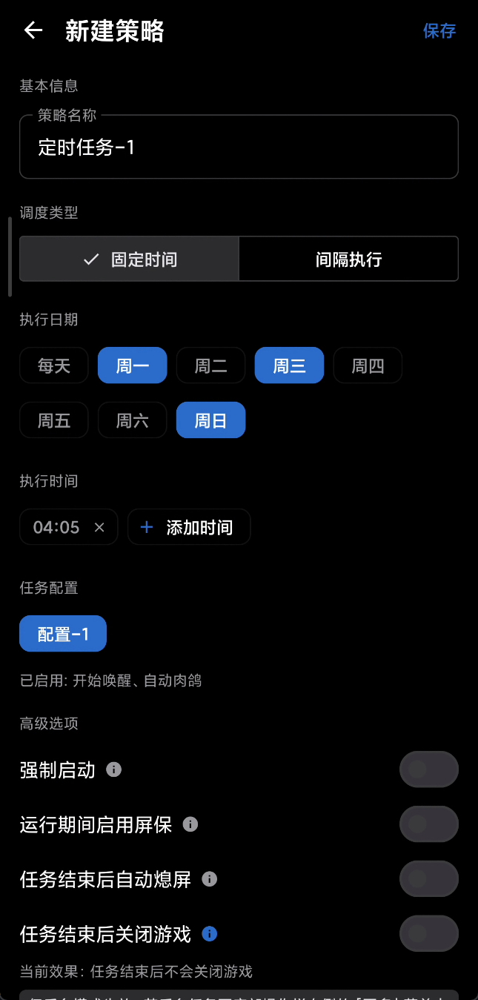
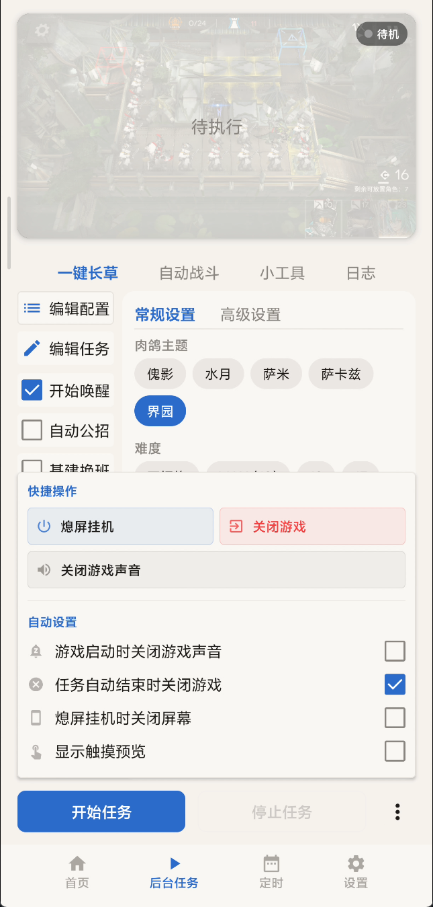

# MAA Droid

**在 Android 设备上原生运行游戏自动化助手 —— 一个 App，多个游戏**

基于图像识别技术，一键完成全部日常任务

[下载最新版](https://github.com/Aliothmoon/MAA-Meow/releases/latest) · [常见问题](https://docs.maameow.com/faq/getting-started/) · [问题反馈](https://github.com/Aliothmoon/MAA-Meow/issues) · [QQ 交流群](https://join.maameow.com/)

**[English](README_EN.md)** | **中文**

---

> 无需 Root 权限，游戏可后台！正在开发中，功能不稳定，欢迎尝鲜体验～

## 支持的游戏

| 游戏 | 引擎 | 上游 | 状态 |
|---|---|---|---|
| 明日方舟 | `engine-arknights` | [MaaAssistantArknights](https://github.com/MaaAssistantArknights/MaaAssistantArknights) | 可用 |
| 边狱公司 Limbus Company | `engine-limbus` | [LixAssistantLimbusCompany](https://github.com/HSLix/LixAssistantLimbusCompany) | 开发中 |

两个游戏的自动化逻辑与素材都**跟随各自上游更新**：改流程、改模板、改阈值靠资源包热更直接生效，无需等应用发版。

接入新游戏只需新增一个引擎模块（一份 `GameProfile` + 一个 `AutomationEngine` 实现 + 一行注册），平台层与既有引擎均不改动 —— 详见 [架构说明](docs/zh-cn/develop/ARCHITECTURE.md)。

  
  
  
  

## 特性

|  | 特性 | 说明 |
|---|---|---|
| 🧠 | **原生运行** | 直接在 Android 上运行自动化逻辑，无需 PC 或模拟器 |
| 🎮 | **多游戏** | 同一应用内切换游戏，各游戏引擎可插拔 |
| 🪟 | **双模式运行** | 前台悬浮控制面板 / 后台虚拟显示器无界面运行 |
| 📦 | **完整任务支持** | 理智作战、公招识别、基建托管、抄作业、自动肉鸽等 |
| ⏱️ | **定时任务** | 按预设时间自动启动任务，适合日常挂机 |
| 🔄 | **自动更新** | 启动时自动检查并下载应用和资源更新 |

## 运行要求

| 项目 | 要求 |
|---|---|
| 系统版本 | Android 9+（API 28） |
| 权限方案 | [Shizuku](https://shizuku.rikka.app/) 已运行并授权，或设备已 Root |
| 设备架构 | arm64-v8a 或 x86_64 |

## 文档

| 文档 | 说明 |
|---|---|
| [架构说明](docs/zh-cn/develop/ARCHITECTURE.md) | 多游戏宿主的模块划分、两层引擎注册、资源热更与新游戏接入步骤 |
| [构建指南](docs/zh-cn/develop/BUILDING.md) | 从源码构建 APK |
| [外部自动化集成](docs/zh-cn/develop/AUTOMATION.md) | 通过 Intent / am 命令与 MacroDroid、Tasker 联动 |
| [Roadmap](docs/zh-cn/develop/ROADMAP.md) | 功能规划与进度 |
| [PR 规范](docs/zh-cn/develop/PULL_REQUEST_GUIDELINES.md) | 提交 PR 前的标题、描述、验证与评审约定 |
| [第三方代码声明](docs/zh-cn/develop/THIRD_PARTY_NOTICES.md) | 引用的开源组件及许可证 |

## 参与贡献

欢迎提交 Pull Request！无论是修复 Bug、优化体验还是实现新功能，我们都非常感谢。

1. Fork 本仓库
2. 创建你的分支 (`git checkout -b feat/your-feature`)
3. 提交更改 (`git commit -m 'feat: 添加某某功能'`)
4. 推送到远程 (`git push origin feat/your-feature`)
5. 发起 Pull Request

> 提交信息请遵循 [Conventional Commits](https://www.conventionalcommits.org/) 规范（`feat:`、`fix:`、`docs:` 等）。
> 首次构建请参阅 [构建指南](docs/zh-cn/develop/BUILDING.md)。
> 提交 PR 前请阅读 [PR 规范](docs/zh-cn/develop/PULL_REQUEST_GUIDELINES.md)。

如果觉得项目有用，欢迎点一个 Star ⭐ 让更多人看到！

## 与上游项目的关系

请注意以下几点，以免误解：

- **本项目不是 MaaAssistantArknights 的官方 Android 端**，也不隶属于其开发团队。本项目通过 JNA 加载上游发布的 `libMaaCore.so` 预编译产物来驱动明日方舟，遇到问题请先在本仓库反馈，不要向上游提。
- **边狱公司引擎移植自 LixAssistantLimbusCompany**，是其 AGPL-3.0 衍生作品，同样与上游开发者无隶属关系。流水线定义、模板素材与 ONNX 模型均取自上游并原样使用，具体移植范围见[第三方代码声明](docs/zh-cn/develop/THIRD_PARTY_NOTICES.md)。
- 两个上游项目均以 AGPL-3.0 发布，本项目沿用同一许可证。
- 游戏内素材、图标与商标归各自版权方所有，**不属于本项目开源内容**。

## 致谢

- [MaaAssistantArknights](https://github.com/MaaAssistantArknights/MaaAssistantArknights) — 明日方舟游戏小助手，基于图像识别技术
- [LixAssistantLimbusCompany](https://github.com/HSLix/LixAssistantLimbusCompany) — 边狱公司助手，本项目边狱引擎的移植来源
- [AhabAssistantLimbusCompany](https://github.com/KIYI671/AhabAssistantLimbusCompany) — 边狱公司助手，资源清单协议与 Android 键码映射的设计参考
- [Genymobile/scrcpy](https://github.com/Genymobile/scrcpy) — Display and control your Android device.
- [Shizuku](https://github.com/RikkaApps/Shizuku) — Using system APIs directly with adb/root privileges from normal apps through a Java process started with app_process.

## 许可证

本项目以 [AGPL-3.0](LICENSE) 许可证发布。第三方代码保留其原始许可证，详见[第三方代码声明](docs/zh-cn/develop/THIRD_PARTY_NOTICES.md)。
